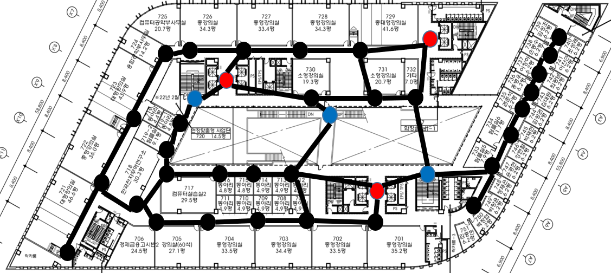

# design-of-data-structure-assignment-2nd

> Solve CAU @100 hall optimal path

## Prerequisite

## Meeting notes

- [Constraints and cases](./meetings/1st-constraints-and-cases.md)
- [Algorithms](./meetings/2ndweek_algorithm.md)

## Collaborators

- [염승윤](https://github.com/yeomyeom)
- [김성윤](https://github.com/SeongYunKim)
- [양의현](https://github.com/noahluftyang)
- [이상묵](https://github.com/mukisang)
- [이제홍](https://github.com/kze20134652)
- [황제웅](https://github.com/Yukinyaa)

## 프로젝트 개요
   
   중앙대학교 310관은 경영경제학부, 산업보안학과, 소프트웨어학부 등 여러 학부가 같이 사용하는 지상 12층 지하 5층 건물입니다.
   그러다보니 엘레베이터 앞은 항상 붐비고 이동하는데에 많은 시간이 걸립니다.
   이에 310관을 최단시간에 움직일 수 있도록 310관 네비게이션 프로그램을 만들고자 했습니다.
   시간별 요일별 유동인구를 알아내 가장 빠르게 도착하는 엘리베이터나 계단을 이용하여 최단 시간에 도착할 수 있는 경로를 추천해주는 것을 목표로 하고 있습니다.

## 전재 조건
   1. 가장 많이 붐비는 시간대는 수업 시작 전 15분 수업 종료 후 15분 이 시간대에만 유동 인구 파악하여 경로 추천 나머지 시간대에는 현재 위치에서 가장 가까운 엘리베이터 추천
   2. 대부분 수업이 끝나면 엘리베이터로 이동

## 구현
   # 자료구조
   
   데이터 구조 : 방향성 그래프
   노드 : 엘리베이터, 계단, 강의실
   엣지 : 길
   
   # 강의 인원 데이터
   [수업 정보](https://github.com/yeomyeom/Data-structure-Design/blob/master/Team%20Project/design-of-data-structure-assignment-2nd-master/dataset/310-ap-peole-from-cau.xlsx)
   시간, 요일별 각 강의실에 강의를 듣는 학생 수

   # 유동 인구 데이터
   [유동인구 정리한 파일](https://github.com/yeomyeom/Data-structure-Design/blob/master/Team%20Project/design-of-data-structure-assignment-2nd-master/dataset/18-11-16-elevator-people.xlsx)
   시간, 요일별 엘리베이터 앞 Smart-CAU(교내 wifi) AP(access point) 접속자 수와 AP 기기 위치를 기반으로 어느 위치에 몇명이 있는지 파악하여 혼잡도 계산

   # 최단 경로 알고리즘
   알고리즘 : 다익스트라 알고리즘

## 기술 스택
   
   Java spring(백엔드)
   HTML, Javascript(프론트엔드)